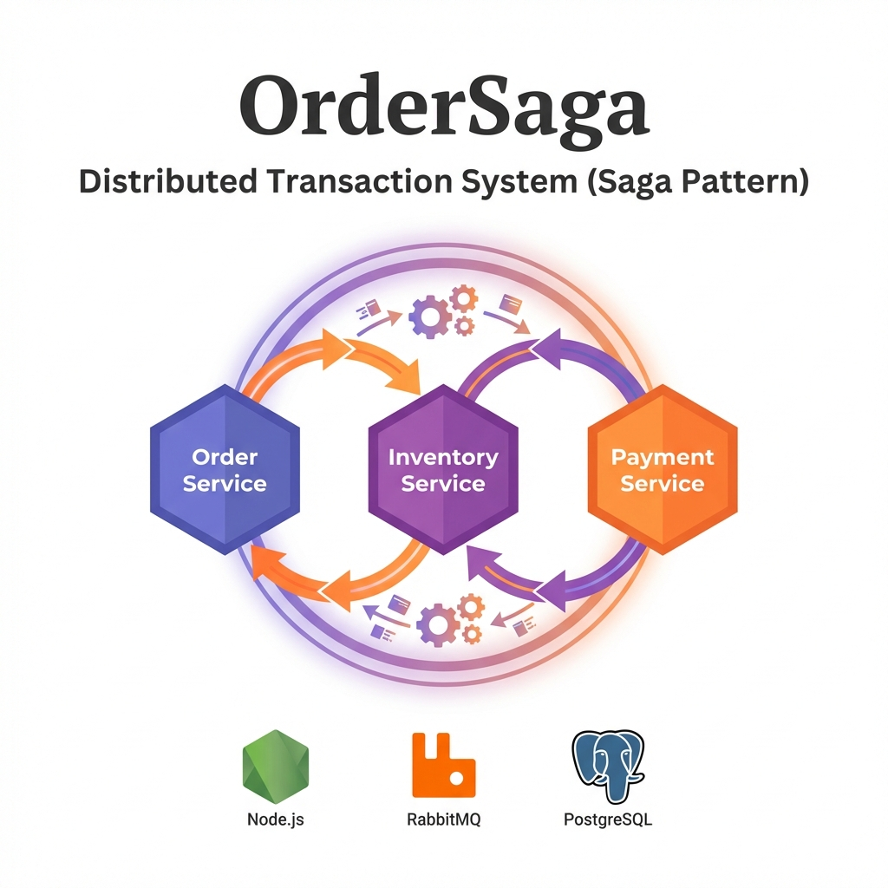
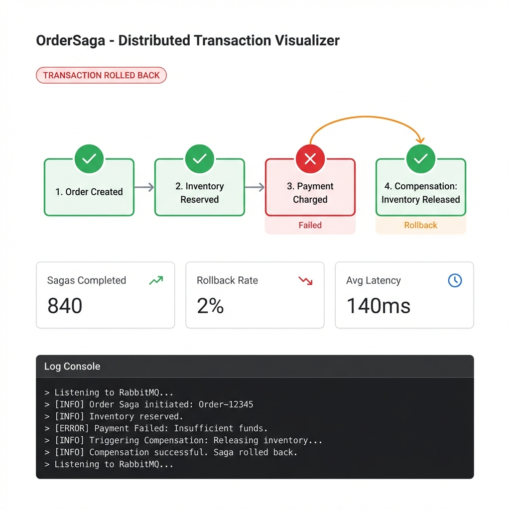
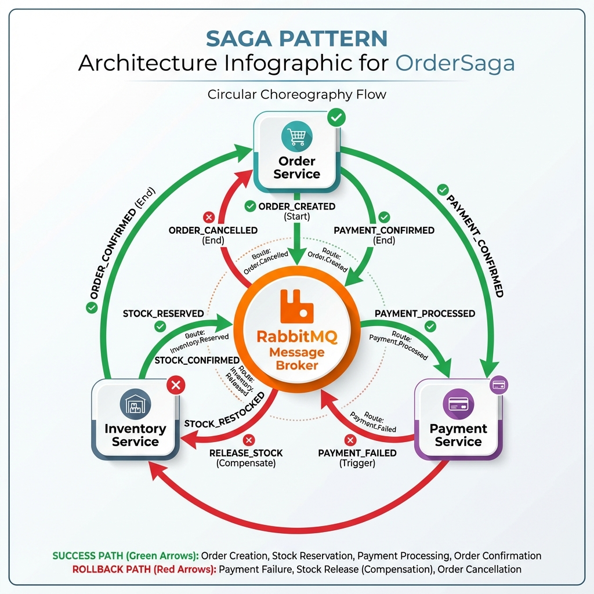
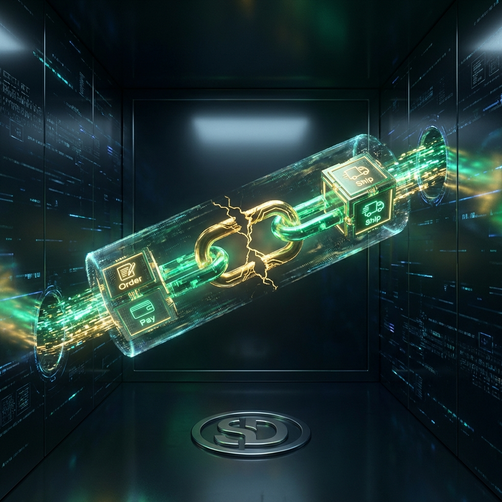
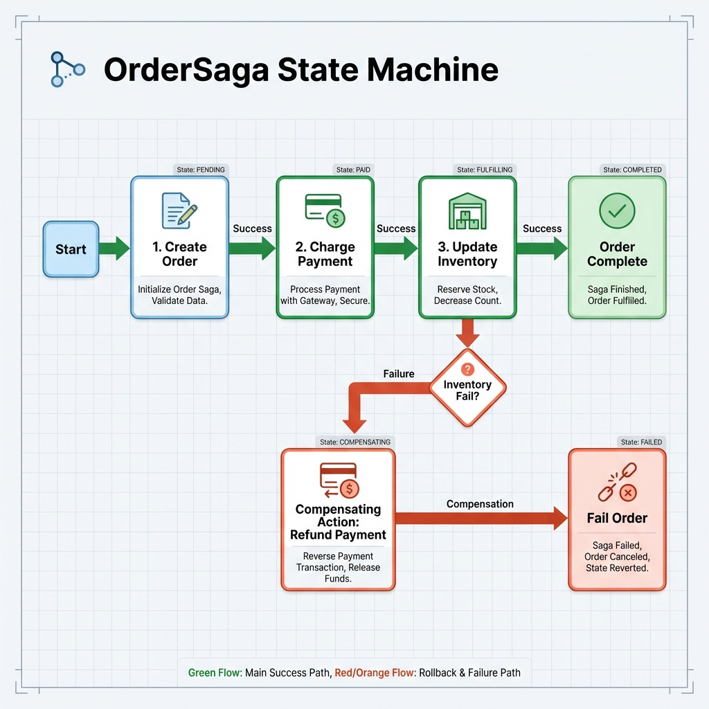

# OrderSaga - Distributed Transaction System (Saga Pattern)



## Distributed Saga Pattern Engine

<div align="center">


</div>

**OrderSaga** is a distributed transaction orchestration system designed to solve the consistency problem in microservices. It implements the **Choreography-based Saga Pattern** to ensure that multi-service operations (Order -> Inventory -> Payment) are either 100% completed or gracefully rolled back using compensating transactions.

---

## 🚀 Quick Start

Launch the entire cluster in 2 steps:

```bash
# 1. Start Infrastructure (RabbitMQ + Postgres)
docker-compose up -d

# 2. Start Services (Order, Inventory, Payment, UI)
npm install && npm run dev
```

> **Detailed Setup**: See [GETTING_STARTED.md](./docs/GETTING_STARTED.md).

---

## 📸 Demo & Architecture

### Real-time Event Stream Dashboard

*Monitoring transactions as they flow through the RabbitMQ bus.*

### System Architecture

*Decoupled microservices communicating via an asynchronous event bus.*

### Saga Failover & Rollback

*Visualizing the automated undo logic when a payment step fails.*

> **Deep Dive**: See [ARCHITECTURE.md](./docs/ARCHITECTURE.md) for Decision Logs and HLD.

---

## ✨ Key Features

*   **⚡ Choreography-based Saga**: Decentralized transaction state management.
*   **🔄 Automatic Rollbacks**: Built-in compensation logic for failed payments.
    
*   **📦 Idempotent Consumers**: Safe message redelivery without data duplication.
*   **📊 Transaction Telemetry**: Real-time observability of event status.

---

## 🏗️ The Transaction Journey

Understanding how a user click propagates through the distributed system:


1.  **Command**: User initiates order (creates `PENDING` record).
2.  **Notification**: `ORDER_CREATED` event published to RabbitMQ.
3.  **Reservation**: Inventory service marks stock as `RESERVED`.
4.  **Charge**: Payment service attempts credit card auth.
5.  **Completion**: On success, order marks as `CONFIRMED`. On failure, triggers compensation.

---

## 📚 Documentation

| Document | Description |
| :--- | :--- |
| [**System Architecture**](./docs/ARCHITECTURE.md) | Deep dive into Saga vs Orchestration and LLD. |
| [**Getting Started**](./docs/GETTING_STARTED.md) | Step-by-step setup and env configuration. |
| [**Failure Scenarios**](./docs/FAILURE_SCENARIOS.md) | Resilience testing and chaos engineering results. |
| [**Interview Q&A**](./docs/INTERVIEW_QA.md) | Executive summary and system design pitch. |

---

## 🔧 Tech Stack

| Component | Technology | Role |
| :--- | :--- | :--- |
| **Messaging** | **RabbitMQ** | Asynchronous Event Bus. |
| **Services** | **Node.js / TS** | Core Microservices logic. |
| **Database** | **PostgreSQL** | Distributed Persistent State. |
| **Interface** | **Next.js 14** | Transaction Monitoring UI. |

---

## 👤 Author

**Harshan Aiyappa**  
Senior Full-Stack Hybrid Engineer  
[GitHub Profile](https://github.com/Kimosabey)

---

## 📝 License

This project is licensed under the MIT License - see the [LICENSE](LICENSE) file for details.
