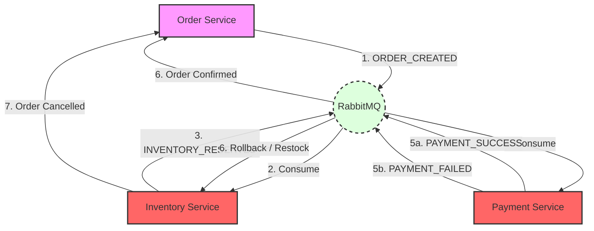

# OrderSaga - Distributed Transaction System (Saga Pattern)

## 🚀 The Challenge
In a microservices architecture, you cannot use local database transactions (ACID) across different services. If an Order is created but Payment fails, the Inventory (which was already reserved) becomes inconsistent.

**OrderSaga** solves this using the **Choreography-based Saga Pattern**. It ensures eventual consistency without using a centralized orchestrator or distributed locks.

## 🛠 Tech Stack
- **Services:** Node.js, Express, TypeScript (Monorepo)
- **Messaging:** RabbitMQ (Event-Driven Communication)
- **Frontend:** Next.js 14, Chakra UI, Framer Motion
- **Infrastructure:** Docker, PostgreSQL

## 🧠 Architecture Flow
The system relies on an event loop to handle Distributed Transactions:



1. **Order Service:** Creates Order (PENDING) → Emits `ORDER_CREATED`
2. **Inventory Service:** Consumes event → Deducts Stock → Emits `INVENTORY_RESERVED`
3. **Payment Service:** Consumes event → Charges User
    - **Success:** Emits `PAYMENT_SUCCESS` → Order Confirmed.
    - **Failure:** Emits `PAYMENT_FAILED` → Triggers **Rollback**.
4. **Rollback (Compensation):** Inventory Service listens for failure → Restocks Item → Order Cancelled.

## ⚡ How to Run Locally
1. **Infrastructure**:
   ```bash
   docker-compose up -d
   ```
2. **Start Services** (Run in separate terminals):
   - **Order Service**: `cd order-service && npm run dev`
   - **Inventory Service**: `cd inventory-service && npm run dev`
   - **Payment Service**: `cd payment-service && npm run dev`
   - **Client**: `cd client && npm run dev`

📘 **[Read the High-Level Design (HLD)](docs/hld.md)** for architecture details.
🛠️ **[Setup Guide](docs/setup.md)** for detailed installation.
🔄 **[Transaction Flow Details](docs/flow.md)** for sequence diagrams.
🎓 **[Senior Interview Cheat Sheet](docs/interview_cheat_sheet.md)** for system design Q&A.

## 🖼️ Visual Gallery (V3 Standard)

|  |  |
|:---:|:---:|
| **Event Stream UI** | **RabbitMQ Performance Metrics** |

|  |  |
|:---:|:---:|
| **Saga Flow & Rollbacks** | **Distributed Infrastructure** |

---

## 🎯 Senior Engineer Signals (Self-Audit)

*   **Atomic Transactions**: Implemented idempotent event consumers to prevent double-charging or over-stocking.
*   **Observability**: Integrated health checks for RabbitMQ and PostgreSQL to monitor cluster health.
*   **Error Handling**: Built a "Dead Letter Queue" for unhandled message exceptions.
*   **Scalability**: Stateless order handlers allow for horizontal scaling via Kubernetes.

---

## 👤 Author
**Harshan Aiyappa**  
Senior Full-Stack Hybrid AI Engineer  
[Portfolio](https://kimo-nexus.vercel.app/) • [GitHub](https://github.com/Kimosabey)
