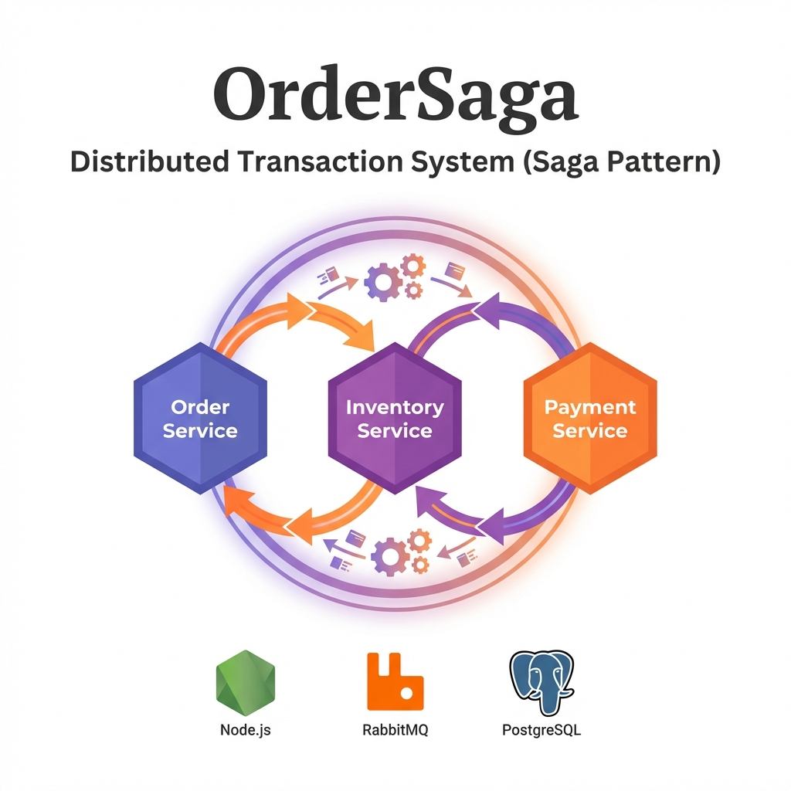
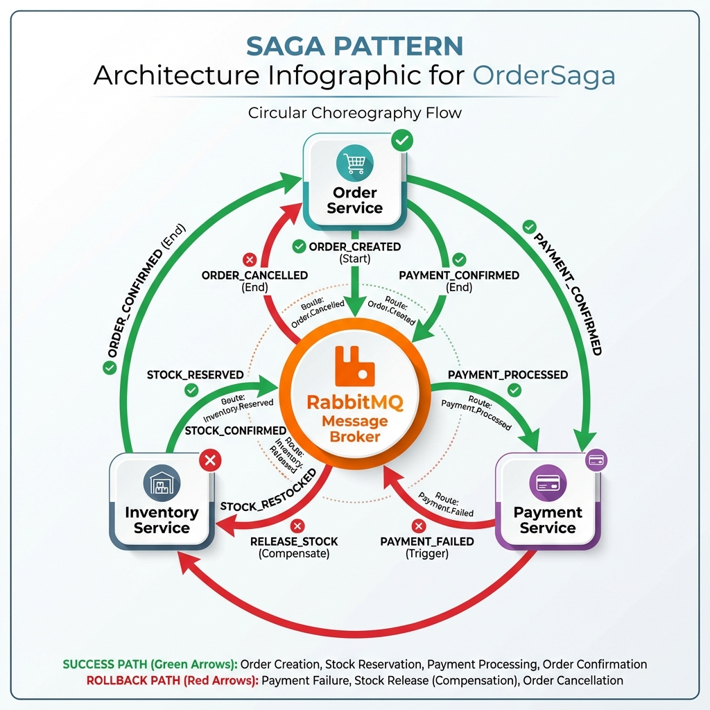

# OrderSaga



## Distributed Transaction System (Saga Pattern)

<div align="center">


</div>

**OrderSaga** is a reference implementation of the **Distributed Saga Pattern** using Node.js, RabbitMQ, and PostgreSQL. It demonstrates how to maintain data consistency across microservices without using 2-Phase Commit (2PC), handling failures via **Compensating Transactions**.

---

## 🚀 Quick Start

Run the entire system (Infra + 4 Microservices):

```bash
# 1. Start Infrastructure (RabbitMQ + Postgres)
docker-compose up -d

# 2. Start Services (Requires 4 Terminals or 'concurrently')
# Terminal 1: Order Service
cd order-service && npm install && npm run dev
# Terminal 2: Inventory Service
cd inventory-service && npm install && npm run dev
# Terminal 3: Payment Service
cd payment-service && npm install && npm run dev
# Terminal 4: Frontend
cd client && npm install && npm run dev
```

> **Detailed Setup**: See [GETTING_STARTED.md](./docs/GETTING_STARTED.md) for full instructions.

---

## 📸 Demo & Architecture

### System Architecture (The Flow)


The system relies on an **Event Loop** (Choreography):
1.  **Order Service**: Emits `ORDER_CREATED`.
2.  **Inventory Service**: Reserves stock -> Emits `INVENTORY_RESERVED`.
3.  **Payment Service**: Charges card.
    *   **Success**: Emits `PAYMENT_SUCCESS` -> Order Confirmed.
    *   **Failure**: Emits `PAYMENT_FAILED` -> Triggers **Rollback**.

> **Deep Dive**: See [ARCHITECTURE.md](./docs/ARCHITECTURE.md) for Sequence Diagrams.

---

## ✨ Key Features

*   **🔄 Distributed Transactions**: Ensures consistent data across 3 separate databases.
*   **🔙 Automatic Rollback**: Implements "Compensating Transactions" to undo steps if a process fails.
*   **📨 Event-Driven**: Fully decoupled communication using **RabbitMQ**.
*   **🏢 Database-Per-Service**: Strict isolation; no shared databases.

---

## 📚 Documentation

| Document | Description |
| :--- | :--- |
| [**System Architecture**](./docs/ARCHITECTURE.md) | High-Level Design, Sequence Diagrams, and Decisions. |
| [**Getting Started**](./docs/GETTING_STARTED.md) | Setup guide for local development. |
| [**Failure Scenarios**](./docs/FAILURE_SCENARIOS.md) | Deep dive into Rollbacks & Eventual Consistency. |
| [**Interview Q&A**](./docs/INTERVIEW_QA.md) | "Choreography vs Orchestration" & other questions. |

---

## 🔧 Tech Stack

| Component | Technology | Role |
| :--- | :--- | :--- |
| **Services** | **Node.js + Express** | Microservices API logic. |
| **Messaging** | **RabbitMQ** | Asynchronous Event Bus. |
| **Database** | **PostgreSQL** | Relational data persistence. |
| **Frontend** | **Next.js 14** | Dashboard to trigger/visualize Sagas. |

---

## 👤 Author

**Harshan Aiyappa**  
Senior Full-Stack Hybrid Engineer  
[GitHub Profile](https://github.com/Kimosabey)

---

## 📝 License

This project is licensed under the MIT License - see the [LICENSE](LICENSE) file for details.