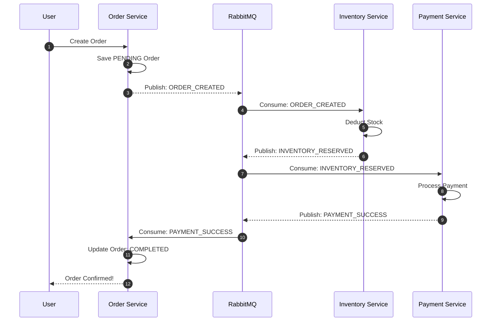
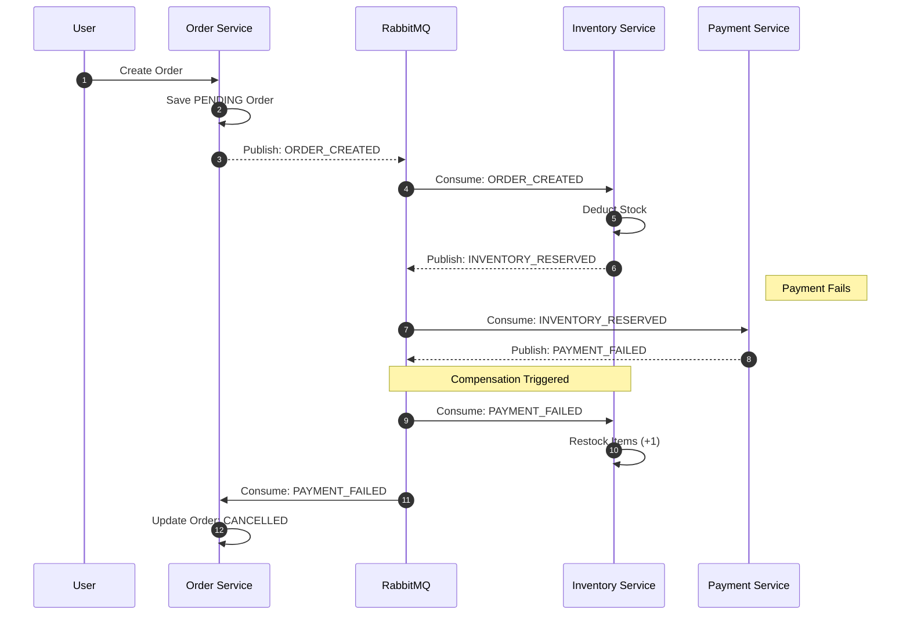

# 🏗️ System Architecture: OrderSaga

> Deep dive into the distributed system design, transaction management, and service boundaries.

---

## 1. High-Level Design (HLD)

OrderSaga utilizes a **Choreography-based Saga Pattern** to manage distributed transactions across microservices. Unlike traditional 2PC (Two-Phase Commit), this architecture favors **Availability** and **Partition Tolerance** (CAP Theorem) by ensuring eventual consistency through asynchronous event streams.

### System Workflow

The system relies on RabbitMQ as the central nervous system, where each service reacts to specific domain events to move the transaction state forward.

#### Transaction Sequences
Below are the detailed sequence diagrams for both success and failure states.

##### ✅ Happy Path: Order Success

##### ❌ Rollback Path: Payment Failure

---

## 2. Low-Level Design (LLD)

### Data Models (PostgreSQL)
Each service maintains its own isolated database to ensure loose coupling.

#### Order Service (`orders` table)
| Column | Type | Description |
| :--- | :--- | :--- |
| `id` | UUID | Primary Key |
| `user_id` | UUID | Customer identifier |
| `total` | Decimal | Order amount |
| `status` | ENUM | `PENDING`, `CONFIRMED`, `CANCELLED` |
| `created_at` | Timestamp | Audit trail |

#### Inventory Service (`stock` table)
| Column | Type | Description |
| :--- | :--- | :--- |
| `item_id` | String | Unique Identifier |
| `quantity` | Integer | Current stock level |
| `reserved` | Integer | Stock under temporary hold |

### API & Event Contracts
Services communicate primarily via RabbitMQ exchanges.

*   **`ORDER_CREATED`**: Published by Order Svc when a user initiates a purchase.
*   **`INVENTORY_RESERVED`**: Published by Inventory Svc after successful stock deduction.
*   **`PAYMENT_SUCCESS`**: Published by Payment Svc after credit card authorization.
*   **`ORDER_FAILED`**: Published by any service to trigger compensating transactions (rollbacks).

---

## 3. Decision Log

### Why RabbitMQ over Kafka?
*   **Routing**: RabbitMQ provides sophisticated routing (topic/direct/fanout) which is perfect for complex transaction flows.
*   **Latency**: Lower latency for simple message passing compared to Kafka’s log-based architecture.
*   **Simplicity**: Easier to manage "At-Most-Once" vs "At-Least-Once" delivery semantics for transactional integrity.

### Why Choreography over Orchestration?
*   **Decoupling**: No central "God Service" (Orchestrator) needs to know about every other service.
*   **Resilience**: No single point of failure in the transaction controller.
*   **Scalability**: Services can be scaled independently based on their own load.

---

## 4. Concept Deep Dives

### The Saga Compensation Logic
When a "downstream" service fails (e.g., Payment rejected), the system must "undo" previous work:
1.  **Payment Service** emits `PAYMENT_FAILED`.
2.  **Inventory Service** listens for `PAYMENT_FAILED` and adds the reserved stock back to the shelf (Compensating Transaction).
3.  **Order Service** listens for `PAYMENT_FAILED` and marks the order as `CANCELLED`.

### Idempotency (Atomic Processing)
To prevent processing the same event twice (e.g., charging a user twice if a message is retried), we use **Idempotency Keys**:
*   Every event carries a unique `transaction_id`.
*   Services check a `processed_events` table before executing logic.
*   If the ID exists, the message is acknowledged and ignored.
