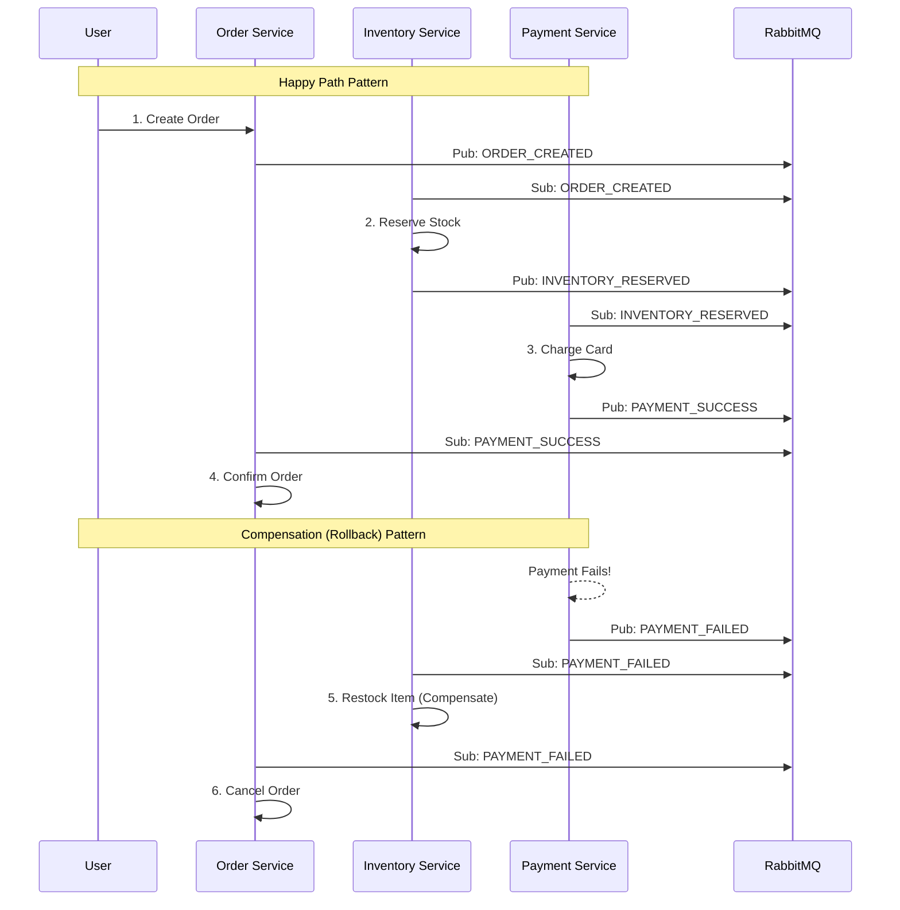

# 🏗️ System Architecture

## 1. High-Level Design (HLD)

OrderSaga implements the **Chioreography-based Saga Pattern** to handle distributed transactions across microservices. Unlike a Monolith where a single `BEGIN TRANSACTION...COMMIT` works, Microservices require a mechanism to ensure **Eventual Consistency** when operations span multiple databases.


```mermaid
sequenceDiagram
    participant U as User
    participant O as Order Service
    participant I as Inventory Service
    participant P as Payment Service
    participant MQ as RabbitMQ

    Note over U, P: Happy Path Pattern
    U->>O: 1. Create Order
    O->>MQ: Pub: ORDER_CREATED
    I->>MQ: Sub: ORDER_CREATED
    I->>I: 2. Reserve Stock
    I->>MQ: Pub: INVENTORY_RESERVED
    P->>MQ: Sub: INVENTORY_RESERVED
    P->>P: 3. Charge Card
    P->>MQ: Pub: PAYMENT_SUCCESS
    O->>MQ: Sub: PAYMENT_SUCCESS
    O->>O: 4. Confirm Order

    Note over U, P: Compensation (Rollback) Pattern
    P-->>P: Payment Fails!
    P->>MQ: Pub: PAYMENT_FAILED
    I->>MQ: Sub: PAYMENT_FAILED
    I->>I: 5. Restock Item (Compensate)
    O->>MQ: Sub: PAYMENT_FAILED
    O->>O: 6. Cancel Order
```

### Core Components
1.  **RabbitMQ (Event Bus)**: The nervous system. Services do not talk via HTTP (REST); they only publish/subscribe to events. This ensures loose coupling.
2.  **Order Service (Manager)**: Manages the lifecycle of an order (Pending -> Confirmed | Cancelled).
3.  **Inventory Service (Resource)**: Manages ACID transactions for stock levels. Listen for orders to reserve stock; listens for failures to release it.
4.  **Payment Service (Gatekeeper)**: Simulates payment processing. The point of failure that triggers rollbacks.

---

## 2. Low-Level Design (LLD)

### Event Schema
We use a standard JSON envelope for all events:
```typescript
interface EventEnvelope {
  type: "ORDER_CREATED" | "INVENTORY_RESERVED" | "PAYMENT_FAILED";
  correlationId: string; // The UUID of the Order
  payload: any;
  timestamp: string;
}
```

### Database Schema (PostgreSQL)
Each service has its **Own Database** (Database-per-Service pattern).
*   **OrderDB**: `orders` table (id, status, amount).
*   **InventoryDB**: `products` table (id, stock_count).
*   **PaymentDB**: `transactions` table (id, order_id, status).

---

## 3. Decision Log

| Decision | Alternative | Reason for Choice |
| :--- | :--- | :--- |
| **Choreography Saga** | Orchestration Saga | **Decentralization**. For a 3-service flow, a central orchestrator (like Temporal) is overkill. Choreography allows services to be autonomous. |
| **RabbitMQ** | Kafka | **Smart Routing**. RabbitMQ's strict ordering and exchange routing make it easier to implement specific Saga flows compared to Kafka's offset management for this scale. |
| **PostgreSQL** | MongoDB | **ACID**. Stock management requires strict row-level locking to prevent race conditions (overselling). |

---

## 4. Key Patterns

### The "Compensation" Pattern
If any step fails (e.g., Payment Declined), we cannot "Undo" the previous steps magically. We must execute a **Compensating Transaction**.
*   *Action*: Reserve Stock (-1)
*   *Compensation*: Release Stock (+1)

### Idempotency
Because RabbitMQ guarantees "At Least Once" delivery, a service might receive the same message twice. We handle this by checking if the `correlationId` has already been processed before executing logic.
