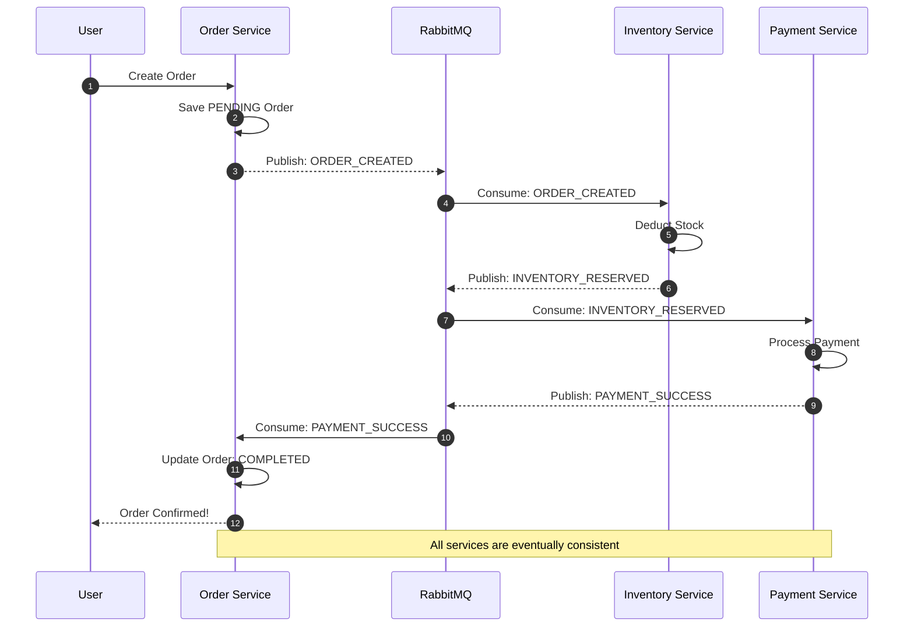
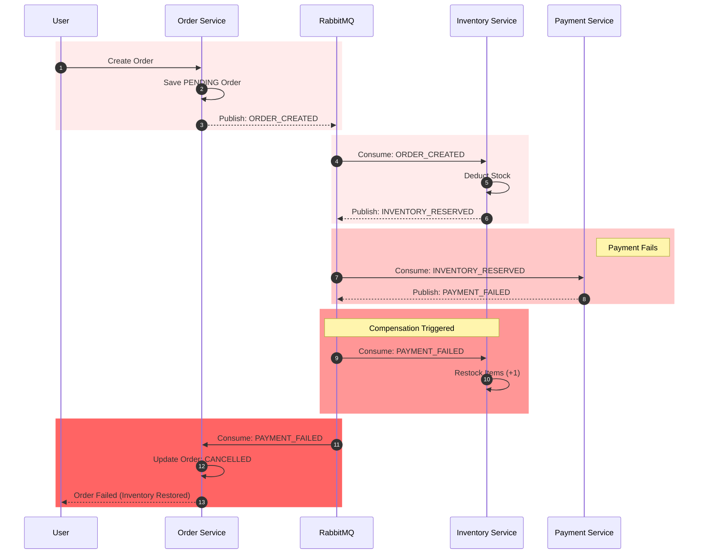

# 🔄 Transaction Flow Details
This document details the step-by-step event flow of the **Choreography Saga Pattern** used in OrderSaga.

## ✅ Happy Path: Order Success
When everything works correctly, the system follows this sequence:

## ❌ Rollback Path: Payment Failure
If the payment fails (e.g., insufficient funds), the system must compensate by restocking items:

## 🧠 Key Concepts
- **Isolation**: Each service only cares about its own database.
- **Eventual Consistency**: The system is not consistent immediately, but becomes so after all events are processed.
- **Idempotency**: Services should be able to handle the same event multiple times without side effects (crucial for retries).
