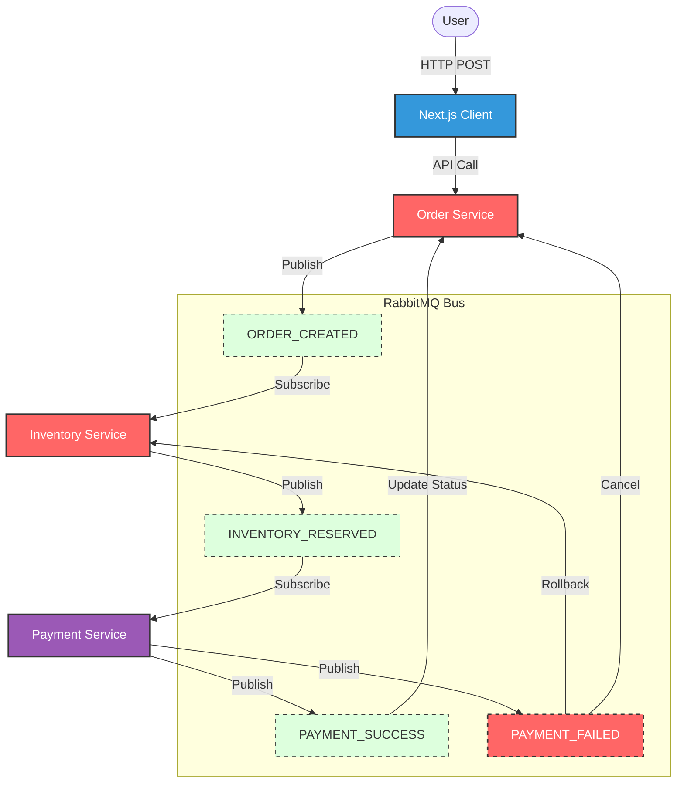

# OrderSaga: High-Level Design (HLD)

## 1. Project Overview
**OrderSaga** demonstrates a distributed transaction system using the **Saga Pattern** (Choreography approach) to ensure data consistency across microservices without distributed locks.

**Goal**: Complete an order lifecycle across Order, Inventory, and Payment services, guaranteeing that either all steps succeed or all are rolled back.

## 2. Tech Stack
- **Services**: Node.js (Express/TypeScript)
  - `order-service`: The State Aggregator (tracks overall status).
  - `inventory-service`: Manages stock.
  - `payment-service`: Manages transactions.
- **Message Broker**: RabbitMQ (Asynchronous communication).
- **Database**: PostgreSQL (Simulated/Actual) with separate schemas to enforce strict service boundaries.
- **Frontend**: Next.js (Dashboard & Visualizer).

## 3. Architecture & Mental Model

## 4. Saga Logic (The State Machine)

### The Happy Path
1. **Order Service**: Creates Order (Status: `PENDING`), Publishes `ORDER_CREATED`.
2. **Inventory Service**: Consumes `ORDER_CREATED`, Reserves Stock, Publishes `INVENTORY_RESERVED`.
3. **Payment Service**: Consumes `INVENTORY_RESERVED`, Charges User, Publishes `PAYMENT_SUCCESS`.
4. **Order Service**: Consumes `PAYMENT_SUCCESS`, Updates Order (Status: `CONFIRMED`).

### The Rollback Path (Compensating Transactions)
1. **Order Service**: Creates Order, Publishes `ORDER_CREATED`.
2. **Inventory Service**: Reserves Stock, Publishes `INVENTORY_RESERVED`.
3. **Payment Service**: Consumes `INVENTORY_RESERVED`, **Fails Charge** (e.g., limit exceeded), Publishes `PAYMENT_FAILED`.
4. **Order Service**: Consumes `PAYMENT_FAILED`, Updates Order (Status: `CANCELLED`).
5. **Inventory Service**: Consumes `PAYMENT_FAILED`, **Releases Stock** (Compensating Action), Publishes `INVENTORY_REFUNDED`.

## 5. Failure Scenarios (Senior Signals)

| Scenario | Expected Behavior (Resilience) |
| :--- | :--- |
| **Inventory Service Down** | Message `ORDER_CREATED` remains in RabbitMQ (Durable Queue). Inventory processes it when it comes back online. No data loss. |
| **Payment Service Down** | Inventory reserved stock. `INVENTORY_RESERVED` waits in Queue. Payment processes later. |
| **Partial Failure** | If Payment fails but message is lost, a generic timeout monitor (Chron) in Order Service should trigger a manual check or rollback. |

## 6. API Contracts

### Events
- `ORDER_CREATED`: `{ id, userId, item, price, status: 'PENDING' }`
- `INVENTORY_RESERVED`: `{ id, item, ... }`
- `PAYMENT_FAILED`: `{ id, reason: 'insufficient_funds' }`

## 7. Test Cases & Limitations
See **[docs/test_cases.md](test_cases.md)** for a detailed matrix of what is covered vs. missing production scenarios.

---
*Created per Kimo’s Golden Trio guidelines.*
