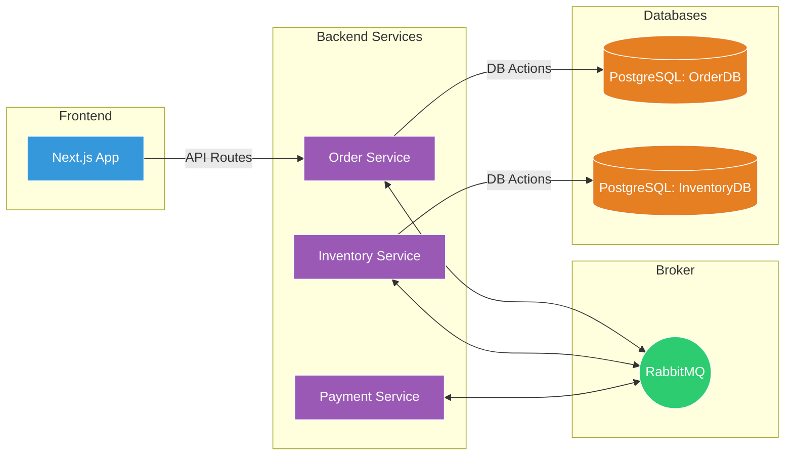

# 🛠️ Setup Guide
Detailed instructions to get the **OrderSaga** system running on your local machine.

## 🏗️ System Architecture
The following diagram illustrates how the services interact with the infrastructure components:



## 📋 Prerequisites
- **Node.js**: v18+
- **Docker**: Desktop or Engine
- **NPM/PNPM**: For package management

## 🚀 Getting Started

### 1. Clone the Repository
```bash
git clone https://github.com/your-username/ordersaga-monorepo.git
cd ordersaga-monorepo
```

### 2. Infrastructure Setup (Docker)
Ensure Docker is running, then spin up RabbitMQ and PostgreSQL:
```bash
docker-compose up -d
```

### 3. Service Initialization
You need to install dependencies for each service. In a monorepo setup, navigate to each folder:

**Order Service:**
```bash
cd order-service && npm install
```

**Inventory Service:**
```bash
cd inventory-service && npm install
```

**Payment Service:**
```bash
cd payment-service && npm install
```

**Frontend Client:**
```bash
cd client && npm install
```

### 4. Running the Application
Open 4 separate terminals to run all components:
- **Order Service**: `npm run dev`
- **Inventory Service**: `npm run dev`
- **Payment Service**: `npm run dev`
- **Client**: `npm run dev`

## 🩺 Health Check
- RabbitMQ Management UI: [http://localhost:15672](http://localhost:15672) (guest/guest)
- Application: [http://localhost:3000](http://localhost:3000)
